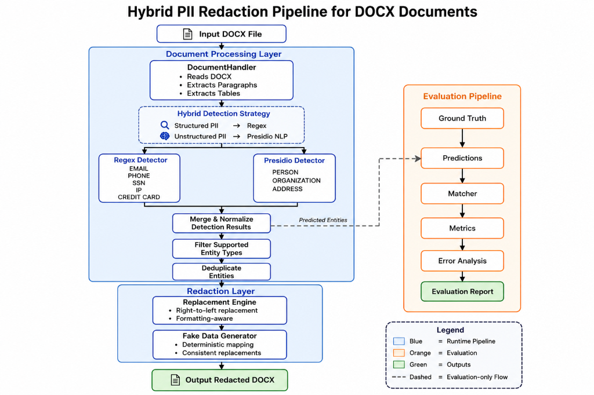

# Hybrid PII Redaction Tool for DOCX

> Automatically detects and replaces Personally Identifiable Information (PII) in Microsoft Word documents using a hybrid pipeline combining deterministic regex matching and Microsoft Presidio (spaCy), while preserving document structure.


🌐 **Live Demo:** [https://disha-pii-redaction-tool.streamlit.app](https://disha-pii-redaction-tool.streamlit.app)


## Architecture

<p align="center">
  
</p>

## Features

- Hybrid regex + NLP detection
- Deterministic fake replacements
- DOCX paragraph & table support
- Streamlit web interface
- Offline evaluation framework

## Supported Entities

| Entity | Detection |
|--------|-----------|
| Email | Regex |
| Phone | Regex |
| SSN | Regex |
| Credit Card | Regex |
| IP Address | Regex |
| Person | Presidio |
| Organization | Presidio |
| Address | Presidio |

## Installation

```bash
git clone <your-repo-url>
cd pii-redaction-tool
python3 -m venv .venv
source .venv/bin/activate
pip install -r requirements.txt
```

## Usage

### Streamlit
```bash
streamlit run app/streamlit_app.py
```

### CLI
```bash
python src/main.py
```

## Evaluation

Evaluated on a manually annotated benchmark containing **100 paragraphs** and **135 labeled entities**.

| Metric | Result |
|--------|--------|
| Strict F1 | 68.1% |
| Lenient F1 | 75.5% |
| Email F1 | 1.000 |
| Phone F1 | 0.976 |

See [`docs/evaluation_report.md`](docs/evaluation_report.md) for the complete evaluation.

## Documentation

Additional project documentation is available in the `docs/` directory:

- [architecture.png](docs/architecture.png) – High-level system architecture
- [document_profile.md](docs/document_profile.md) – Dataset profiling and complexity analysis
- [evaluation_report.md](docs/evaluation_report.md) – Detailed benchmark results and error analysis
- [annotation_guidelines.md](docs/annotation_guidelines.md) – Ground truth annotation protocol

## Project Structure
```text
.
├── app/                  # Streamlit frontend
├── docs/                 # Architecture, evaluation, and annotation docs
├── evaluation/           # Offline evaluation framework and benchmark
├── input/                # Place raw documents here for CLI processing
├── src/                  # Core redaction pipeline (Regex, Presidio, Replacer)
├── tools/                # Helper scripts
└── requirements.txt
```

## Limitations

- **Formatting Loss**: Modifying paragraph text right-to-left can strip granular inline formatting.
- **Capitalization Blindness**: Presidio struggles with ALL CAPS names and headers.
- **Organization Recall**: The generic English NLP model has low recall for localized corporate entities.

## Future Work

- **Run-aware Replacement**: Preserving exact character formatting natively via DOCX runs.
- **OCR & PDF Support**: Adding Tesseract to process image-based PII.
- **Custom Presidio recognizers**: Adding localized recognizers for Indian legal entities and addresses.
- **Fine-tuned NER**: Training custom spaCy models on financial prospectuses.

## Acknowledgement

Developed as part of the **Scaler AI Labs Internship Assignment**.
